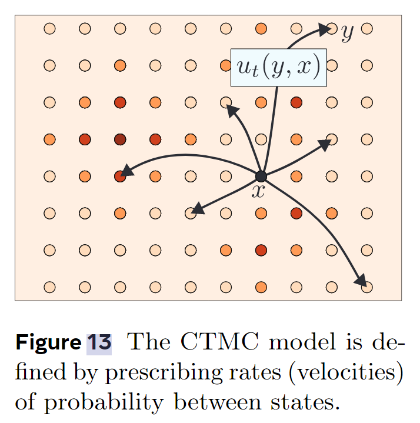

# 连续时间的马可夫链

本文基于Flow Matching Guide and Code[^1] ，主要是读这篇文章时候的笔记。

连续时间的马可夫链（Continuous Time Markov Chains，CTMC）是Flow的替代，也是一种生成式模型，用来生成离散的数据。它是离散型Flow Matching（Discrete Flow Matching， DFM）[^2]的基础。

## 离散状态空间和随机变量

这一节就是讲一些notations。

以类比的方法可以表示离散状态空间：

- 连续状态空间： $\mathbb{R}^{d}$，$d$是空间维度

- 离散状态空间：$\mathcal{S} = \mathcal{T}^d$，$d$是空间维度，其中$\mathcal{T}=[K]=\{1,2,\cdots, K\}$，$\mathcal{T}$也就是vocabulary。

从$\mathcal{S}$中采样的样本记为$x = (x^1,x^2,\cdots,x^d)\in\mathcal{S}$，其中$x^i$就是一个token。

用$X$表示状态空间$\mathcal{S}$中的随机变量，其pmf（probability mass function，概率质量函数，离散分布叫概率质量函数，连续分布叫概率密度函数）为$p_X : \mathcal{S} \to \mathbb{R}_{\ge 0}$，实际上pmf是一个从状态空间$\mathcal{S}$到正实数集的映射。pmf满足求和为1的约束条件：$\sum_{x\in\mathcal{S}}p_X(x)=1$。

对于事件$A\in\mathcal{S}$，其发生概率可以如下计算：
$$
\mathbb{P}(X\in A)=\sum_{x\in A}p_X(x)
$$
还需要一个delta分布（好像也叫Dirac分布）的pmf表示，如下：
$$
\delta(x,z)=\begin{cases}
 +\infty \quad x=z\\
 0\quad \text{else}.
\end{cases}
$$
这个分布表示只有$x$取特定值$z$的时候才有概率，没有概率取其他值。但是该分布的pmf在x的定义域积分也是1。

有时候也会在token层级上定义delta分布，例如$\delta(x^i,y^i)\quad x^i,y^i \in \mathcal{T}$。

关于Dirac分布的更多信息可以参考：https://spaces.ac.cn/archives/1870

## CTMC生成式模型

CTMC是连续时间的马可夫链，马可夫链是离散状态的马可夫过程。所以CTMC是连续时间离散状态的马可夫过程，可以表示为$(X_t)_{0\le t\le 1}$。因为CTMC是随机过程嘛，所以它是一族随机变量。它的马可夫假设可以表示为如下的形式：
$$
\mathbb{P}(X_{t+s}=z\mid X_s =x,X_u=y,0\le u\le s)=\mathbb{P}(X_{t+s}=z\mid X_s = x)
$$
类比离散时间的马可夫链，这个公式说的就是只要知道$X_s$的值后，在$s$时刻之前的值（例如式子中的$X_u$），对$s$时候之后的值没有影响（式中$X_{t+s}$）。即“遗忘过去”。关于CTMC更多的介绍可以参加：https://www.math.pku.edu.cn/teachers/lidf/course/stochproc/stochprocnotes/html/_book/markovc.html#markovc-ctime。

类比扩散模型和Flow Matching，也可以定义CTMC的转移核（probability transition kernel）为$p_{t+h\mid t}$，其形式如下：
$$
p_{t+h\mid t}:= \mathbb{P}(X_{t+h}=y\mid X_t = x)=\delta(y,x)+hu_t(y,x)+o(h), \quad \mathbb{P}(X_0=x)=p(x)\label{eq:transition_kernel}
$$
$p_{t+h\mid t}$的图示如下：

CTMC模型的状态转移过程图示

公式$\ref{eq:transition_kernel}$中，$p$表示随机过程$(X_t)_{0\le t\le 1}$在$t=0$时候的分布（取$t=0$随机过程退化成随机变量）。$o(h)$是高阶无穷小量
$$
\lim_{h\to0} \cfrac{o(h)}{h} = 0
$$
其中，$u_t(y,x)$叫做速率（rates或者velocities），它可以类比Flow Matching里面讲的向量场，在CTMC里面表示的是表示状态之间概率转换的速率，按我的理解，就是下面的这个形式：
$$
u_t(y,x) =\lim_{h\to 0}\cfrac{\mathbb{P}(X_{t+h}=y\mid X_t = x)}{h}
\label{eq:rate}
$$
它是时间$t$的函数。从公式$\ref{eq:rate}$和公式$\ref{eq:transition_kernel}$的角度理解，$\delta(y,x)$就是发生状态转移前（即$t$时刻）的初始状态。具体讲，由于我们以$X_t=x$为条件，所以初始状态就是确定的，用概率形式表示就是$\delta(\cdot,x)$，也就是说初始状态时（即$t$时刻），在$x$处有概率，而其他状态空间中的点概率都是0。

公式$\ref{eq:transition_kernel}$中，$u_t(y,x)$需要满足一定的条件，称为速率条件（rate conditions）：
$$
u_t(y,x)\ge 0 \text{ for all } y\neq x \text{, and }\sum_{y}u_t(y,x) =0 \label{eq:rate_cond}
$$
这样就是说，$u_t(x,x)< 0$，且$u_t(x,x)=-\sum_{y\neq x}u_t(y,x)$。速度条件的存在是为了保证公式$\ref{eq:transition_kernel}$算出的转移核$p_{t+h\mid t}(\cdot\mid x)\ge0$且$\sum p_{t+h\mid t}(\cdot\mid x)=1$。

类比Flow Matching，我们也可以说：**如果存在$p_{t+h\mid t}$满足公式$\ref{eq:transition_kernel}$，$p_{t+h\mid t}$的边缘分布为$p_t$，则称$u_t$生成了$p_t$**。

用公式$\ref{eq:transition_kernel}$，我们也可以用Euler法（类比扩散模型和Flow Matching里面ODE的解法）来采样，如下：
$$
\mathbb{P}(X_{t+h}=y\mid X_t)=\delta(y,X_t)+hu_t(y,X_t)
$$
但是该式引入了一个偏差，就是$o(h)$。因为这是一个高阶小量，所以只要$h$足够小，那么$o(h)$就会趋于0，这就是希望Euler法采样准确的条件，但是这样采样步骤就会很多。一种缓解这个问题的方法是用如下的Euler法：
$$
\mathbb{P}(X_{t+h}=y\mid X_t) =\begin{cases}
\exp \left[hu_t(X_t,X_t)\right] \qquad \qquad\qquad\qquad\qquad y=X_t \\
\cfrac{u_t(y,X_t)}{\left|u_t(X_t,X_t) \right|}\left(
	1 - \exp\left[hu_t(X_t,X_t)\right]
\right) \qquad y\neq X_t
\end{cases}
$$

## 概率路径和Kolmogorov方程

类比连续情况下的一致性方程（Continuity Equation），CTMC模型的边缘概率$p_t$满足Kolmogorov方程：
$$
\cfrac{\mathrm{d}}{\mathrm{d}t}p_t(y)=\sum_x u_t(y,x)p_t(x) \label{eq:Kolmogorov}
$$
下面这个定理描述了上式这种线性ODE系统唯一解的存在性：

**定理**（线性ODE的解的存在性和唯一性）：如果$u_t(y,x)$在$C([0,1))$中（即在时间$t$上连续），那么存在唯一的解$p_t(x)$满足Kolmogorov方程$\ref{eq:Kolmogorov}$，其中，$t\in[0,1)$，初始状态$p_0(x) = p(x)$。

对CTMC而言，在$t\in[0,1)$区间，不需要额外的条件，就能够确定解一定存在。关于该定理的更多详细信息可以参考Coddington et al. (1956)[^3]中的定理5.1和5.2。

方程$\ref{eq:Kolmogorov}$可以化为：
$$
\begin{equation}
\begin{aligned}
\sum_x u_t(y,x)p_t(x) &=\underbrace{\sum_{x\neq y} u_t(y,x)p_t(x)}_{输入通量}-\underbrace{\sum_{x\neq y}u_t(x,y)p_t(y)}_{输出通量} \\
&=-\sum_{x\neq y}\left[j_t(x,y)-j_t(y,x)\right] \\
\end{aligned}
\end{equation}
$$
其中，$j_t(y,x):=u_t(y,x)p_t(x)$，称为概率通量（probability flux）。上式很好理解，就是把从$x$输入到$y$的通量分成了从$x$输入到$y$的部分和从$y$输出到$x$的部分。

将输出通量超出来的部分定义为散度，即
$$
\text{div}(u_t p_t)(y) =\sum_{x\neq y}\left[j_t(x,y)-j_t(y,x)\right]
$$
那么Kolmogorov方程就可以表示为：
$$
\dot p_t(y)+\text{div}(u_t p_t)(y)=0
$$
这和连续型Flow Matching的一致性方程统一起来了。

以下还有一个结果，是在CTMC 框架中构建概率路径和速度的主要工具：

**定理** （离散质量守恒，Discrete Mass Conservation）：$u_t(y,x)$在$C([0,1))$中，$p_t(x)$在$C^1([0,1))$中（我的理解是一阶导数在时间$t$上连续），则如下两个结论是等价的：

- 在$t\in[0,1)$时， $p_t,u_t$满足Kolmogorov方程$\ref{eq:Kolmogorov}$，$u_t$满足速率条件$\ref{eq:rate_cond}$。
- 在$t\in[0,1)$时，$u_t$生成（用前文的术语）了$p_t$。

该定理的证明在[^1]的appendix A.1.。

### 保概率速率（Probability preserving velocities）

如果$u_t(y,x)$生成了概率路径$p_t(x)$，我们构造一个新的速率：
$$
\tilde u_t(y,x) = u_t(y,x) + v_t(y,x)
$$
只要$v_t(y,x)$满足速率条件且
$$
\sum_x v_t(y,x)p_t(x) = 0
$$
那么$\tilde u_t(y,x)$还能Kolmogorov方程：
$$
\sum_x \tilde u_t(y,x)p_t(x) = \sum_x  u_t(y,x)p_t(x) = \dot p_t(y)
$$
那么$\tilde u_t(y,x)$还能生成$p_t(x)$。这个结论在离散型Flow Matching里面非常重要。

---

[^1]: Lipman Y, Havasi M, Holderrieth P, et al. Flow Matching Guide and Code[J]. arXiv preprint arXiv:2412.06264, 2024.
[^2]: Gat I, Remez T, Shaul N, et al. Discrete flow matching[J]. arXiv preprint arXiv:2407.15595, 2024.
[^3]: Coddington E A, Levinson N, Teichmann T. Theory of ordinary differential equations[J]. 1956.