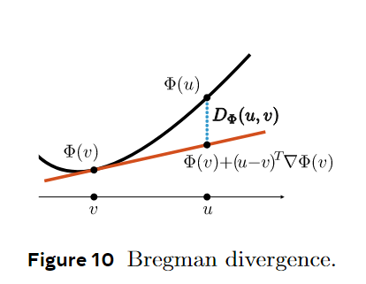

# 离散型流匹配模型

本文是接着上一次学习的CTMC模型继续学习离散型流匹配模型，主要是读Flow Matching Guide and Code[^1]第7章的笔记。并非完全Flow Matching Guide and Code的翻译，挑了一些重要的内容并且加入了我自己的的理解。

要构建一个离散型流匹配模型（Discrete Flow Matching，DFM），分为三个步骤：

1. 类比连续型FM，定义一个概率路径$p_t$，连接原始分布的pmf和目标分布的pmf。pmf就是概率质量函数。
2. 构建一个CTMC模型，${(X_{t})}_{0 \le t \le 1}$，该CTMC的速度场$u_{t}^{\theta}$生成出第1步中的概率路径$p_t$，$\theta$是可学习的参数。
3. 训练$u_{t}^{\theta}$，使之最小化Bregman散度，Bregman散度就是DFM的损失函数。

后面我就把离散型流匹配模型简称为DFM，连续型流匹配模型简称为FM。

## 数据和数据的成对

像FM里面一样，定义源分布的pmf为$p$，目标分布的pmf为$q$。源分布的随机变量（Random Variable，RV）记为$X_0$，目标分布的随机变量记为$X_1$。$X_0,X_1 \in \mathcal{S}$，$\mathcal{S}$就是CTMC模型里面提到的状态空间。

考虑到我们一般把$X_0$和$X_1$放在一起讨论，所以需要找个方式表示$X_0$和$X_1$的成对分布：$(X_0,X_1)\sim p(X_0)q(X_1)$，就是当成两个独立的RV，用二者的pmf的乘积表示$(X_0,X_1)$的联合分布。也可以用单独的符号$\pi_{0,1}(x_0,x_1)$表示$p(x_0)$和$q(x_1)$的联合分布。

举个例子理解，如果对文本生成任务，源分布$p(x_0)$就是先验分布，一般取：

1. $\mathcal{S}$上的均匀分布

2. 加入一个mask的特殊token $\mathtt{m}$到vocabulary $\mathcal{T}$里面，即$\mathcal{T}\cup \{\mathtt{m}\}$。

按第2种方法，此时得到$\pi_{0,1}(x_0,x_1)=\delta(x_0,\mathtt{m})q(x_1)$，先验分布就是$\delta(x_0,\mathtt{m})$。若$X_0 \sim \delta(X_0,\mathtt{m})$，则$X_0=(\mathtt{m},\cdots,\mathtt{m})$。

## 离散概率路径

FM[^2]在研究边缘概率路径$p_t(x)$和生成$p_t(x)$的边缘向量场时$u_t(x)$遇到困难（图像在高维空间中造成[^2]中的公式6和8的积分不可解，因此没办法得到$p_t(x)$和$u_t(x)$的解析式），所以转而求解条件向量场$u_t(x\mid z)$和条件概率路径$p_t(x\mid z)$。仿照这个办法，DFM也可以按如下方式算边缘概率路径（marginal probability path）：
$$
p_t(x) = \sum_{z\in \mathcal{Z}}{p_{t\mid Z}(x\mid z)p_{Z}(z)}\tag{1}
$$
其中$Z\in \mathcal{Z}$是作为条件的随机变量，$\mathcal{Z}$是任意空间。上式是离散版的全概率公式。需要指出的是，**条件概率路径$p_{t\mid Z}(x\mid z)$必须满足边界约束$p_0 = p$和$p_1=q$，**这样才能构建源分布和目标分布之间的关系。

## 边缘化技巧

我们在公式1中已经给出了边缘概率路径$p_t(x)$和条件概率路径$p_{t\mid Z}(x\mid z)$之间的关系，类比在FM里面做的事情，对DFM，我们也想知道条件速度场$u_t(y,x\mid z)$和边缘条件速度场$u_t(y,x)$之间的关系。

为了研究这个问题，可以从FM中获得经验。FM中，如果条件向量场$u_t(\cdot\mid z)$能生成条件概率路径$p_{t\mid Z}(\cdot\mid z)$，那边缘向量场$u_t(x)$满足：
$$
u_t(x) = \int u_t(x\mid z)\cfrac{p_{t\mid Z}(x\mid z)p_Z(z)}{p_t(x)}\mathrm{d} z 
=\int u_t(x\mid z) p_{Z\mid t}(z\mid x) \mathrm{d}z
\tag{2}
$$
公式2可以参考Flow matching for generative modeling[^2]里面的公式8，或者Flow Matching Guide and Code[^1]里面的公式4.12。

类比公式2，是否DFM也存在如下关系：当条件速度场$u_t(\cdot,\cdot\mid z)$生成条件概率路径$p_{t\mid Z}(\cdot\mid z)$时，边缘速度场$u_t(y,x)$满足
$$
u_t(y,x) = \sum_z u_t(y,x \mid z) \cfrac{p_{t\mid Z}(x\mid z)p_Z(z)}{p_t(x)}
=\sum_z u_t(y,x\mid z) p_{Z\mid t}(z\mid x) \tag{3}
$$
答案是肯定的。接下来详细表述和证明这个问题。

---

**假设** $p_{t\mid Z}(x\mid z)\in C^{1}([0,1))$。$u_t(y,x\mid z)\in C([0,1))$。对所有$t\in[0,1)$和$x\in \mathcal{S}$，$p_t(x)> 0$。

**定理** （离散边缘化技巧）当上述假设满足时，如果$u_t(y,x\mid z)$生成$p_{t\mid Z}(x\mid z)$，那么对$t\in[0,1)$，边缘向量场$u_t(y,x)$（公式3）生成边缘概率路径$p_t(x)$（公式1）。

**证明** 
$$
\begin{aligned}
\cfrac{\mathrm{d}}{\mathrm{d}t}p_t(y) &\overset{(1)}{=}  \cfrac{\mathrm{d}}{\mathrm{d}t}\left[
\sum_z{
p_{t\mid Z}\left(y\mid z\right)p_{Z}(z)
}\right]\\
&\overset{(2)}{=} \sum_z{
    \cfrac{\mathrm{d}}{\mathrm{d}t}\left[
		p_{t\mid Z}\left(y\mid z\right)p_{Z}(z)
    \right]
}\\
&\overset{(3)}{=} \sum_z{
    \cfrac{\mathrm{d}}{\mathrm{d}t}\left[
		p_{t\mid Z}\left(y\mid z\right)
    \right]p_{Z}(z)
}\\
&\overset{(4)}{=} \sum_z {\sum_x \left[{
u_t(y,x \mid z) p_{t\mid Z}(x\mid z)
} \right] p_Z(z)}\\
&\overset{(5)}{=} \sum_x {\sum_z \left[{
u_t(y,x \mid z) \cfrac{p_{t\mid Z}(x\mid z)p_Z(z)}{p_t(x)}
} \right] p_t(x)}\\
&\overset{(6)}{=} \sum_x {\overbrace{\sum_z \left[{
u_t(y,x \mid z) p_{Z\mid t}(z\mid x)
} \right]}^{u_t(y,x)}
p_t(x)}
\end{aligned}
\tag{4}
$$

第（4）步是因为根据条件“$u_t(y,x\mid z)$生成$p_{t\mid Z}(x\mid z)$”，我们在CTMC模型中讲到的离散质量守恒Discrete Mass Conservation（Discrete Mass Conservation的假设已经满足了，就是上文给出的假设），可知：

- $u_t(y,x\mid z)$生成$p_{t\mid Z}(x\mid z)$
- $u_t(y,x\mid z)$和$p_{t\mid Z}$满足Kolmogorov方程，且 $u_t(y,x\mid z)$满足速率条件（rate conditions）。

二者等价，故直接带入Kolmogorov方程可得第（4）步，只是加了个条件$z$而已。

第（5）是将$p_Z(z)$拿到内层求和，并在内层求和的分母上添加一个$p_t(x)$，此时还需要再乘$p_t(x)$，可以用分配律把它拿出内层求和。

第（6）步是贝叶斯公式。

最终得出的等式比对一下Kolmogorov方程，可见$u_t(y,x)=\sum_z u_t(y,x \mid z) p_{Z\mid t}(z\mid x)$和$p_t$满足Kolmogorov方程。

然后，$u_t(y,x)$满足速率条件，因为$u_t(y,x \mid z)$满足速率条件，即上文蓝色字的部分。

> 关于为什么$u_t(y,x \mid z)$满足速率条件，$u_t(y,x)$就满足速率条件的证明：
>
> 如果$u_t(y,x \mid z)$满足速率条件，那么 $\forall y\neq x , u_t(y,x\mid z) \ge 0$且$\sum_y u_t(y,x\mid z)=0$
>
> 根据$u_t(y,x)=\sum_z u_t(y,x \mid z) p_{Z\mid t}(z\mid x)$，因为$p_{Z\mid t}(z\mid x)$显然不小于0，故$u_t(y,x) \ge 0$。
> $$
> \begin{aligned}
> \sum_y u_t(y,x) &=\sum_y\sum_z u_t(y,x \mid z) p_{Z\mid t}(z\mid x) \\
> &=\sum_z\sum_y u_t(y,x \mid z) p_{Z\mid t}(z\mid x) \\
> &= \sum_z 0p_{Z\mid t}(z\mid x) \\
> &= 0
> \end{aligned}
> \tag{5}
> $$
> 所以$u_t(y,x)$也满足速率条件。

在再次应用Discrete Mass Conservation之前，还得确定一下假设是否满足，因为$u_t(y,x\mid z)\in C([0,1)$且$p_{t\mid Z}(x\mid z)\in C^{1}([0,1))$，故$u_t(y,x)\in C([0,1))$，$p_t(x)\in C^1([0,1))$。

> 关于为什么$u_t(y,x\mid z)\in C([0,1)$且$p_{t\mid Z}(x\mid z)\in C^{1}([0,1))$，就有$u_t(y,x)\in C([0,1))$。我自己的理解如下：
>
> 因为$p_t(x) = \sum_{z}{p_{t\mid Z}(x\mid z)p_{Z}(z)}$，$p_{t\mid Z}(x\mid z)$在$t\in[0,1)$上连续，$p_Z(z)$和$t$无关，所以$p_t(x)$在$t\in[0,1)$连续。$p_{t\mid Z}(x\mid z)$的一阶导在$t\in[0,1)$上连续，$p_Z(z)$和$t$无关，$\dot p_t(x) = \sum_{z}{\dot p_{t\mid Z}(x\mid z)p_{Z}(z)}$，故$\dot p_t(x)$也在$t\in[0,1)$上连续。
>
> 因为$u_t(y,x)=\sum_z u_t(y,x \mid z) p_{Z\mid t}(z\mid x)= \sum_z u_t(y,x \mid z) \cfrac{p_{t\mid Z}(x\mid z)p_Z(z)}{p_t(x)}$，在$t\in[0,1)$时，$p_{t\mid Z}(x\mid z)$和$u_t(y,x\mid z)$都连续，$p_Z(z)$和$t$无关，根据假设$p_t(x)>0$，同时$p_t(x)$在$t\in[0,1)$连续，所以$u_t(y,x)$在$t\in[0,1)$连续。从这里能看到假设为什么一定要$p_t(x)>0$。
>
> 从上面这些解释就知道$u_t(y,x)\in C([0,1))$，$p_t(x) \in C^1([0,1)$。

所以假设也满足，可以应用Discrete Mass Conservation，得到**$u_t(y,x)$生成$p_{t}(x)$**。证明完毕。

**补充** 关于$t\in[0,1)$时，$p_t>0$的假设是可以满足的。因为我们可以使用$(1-(1-t)\epsilon) \cdot p_{Z\mid t} + (1 - t)\epsilon \cdot p_{\text{uni}}$，其中$p_{\text{uni}}$是均匀分布，$\epsilon$是大于0的很小的值。我的理解就是通过稍微加入一点服从均匀分布的噪声，让$[0,1)$上，$p_t$都有概率。

---

## DFM损失

像FM里面一样，我们可以用一个神经网络来学习速度场$u_{t}^{\theta}(y,x)$，其中$\theta$是可学习的参数。类比FM，可以构建DFM的损失：
$$
L_{DFM}(\theta) = \mathbb{E}_{t,X_t\sim p_t}D_{X_t}\big(u_t(\cdot,X_t),u_t^{\theta}(\cdot,X_t)\big) \tag{6}
$$

这里，$t\sim U[0,1]$，$u_t(\cdot,x)\in R^{\mathcal{S}}$满足速率条件。也就是说，$u_t(\cdot,x)\in \Omega_x$，且：
$$
\Omega_x = \left\{
v \in R^{\mathcal{S}} \mid v(y) > 0 \text{ }\forall y \neq x,\text{ and } v(x) = - \sum_{y\neq x} v(y)  
\right\} \in R^{\mathcal{S}} \tag{7}
$$
$\Omega_x$是凸集合。$D_{X_t}(u,v)$是Bregman散度，其使用凸函数$\Phi_x : \Omega_x \to \mathbb{R}$定义。

---

Bregman的具体计算方式如下图和下式所示：

$$
\displaystyle D( u,v) \ :=\ \Phi ( u) \ -\ [ \Phi ( v) \ +\ \langle u-v,\nabla \Phi ( v) \rangle ] \tag{8}
$$
Bregman散度有一些关键的性质，在FM和DFM里面最关键的是它对第二个参数的梯度有仿射不变性（affine invariant）[^3]：
$$
\nabla_v D(au_1 + b_u2, v) = a\nabla_v D(u_1,v) +b\nabla_vD(u_2,v), \text{ for any } a+b=1 \tag{9}
$$
因为仿射不变性，可以得到$\nabla_vD(\mathbb{E}[Y] ,v) =\mathbb{E}[\nabla_v D(Y,v)]$。

关于Bregman散度的详细信息，在知乎上已经有很好的回答了，可以参考：https://www.zhihu.com/question/22426561。

---

就像在FM里面一样，我们更关注条件DFM（Conditional Discrete Flow Matching，CDFM）的损失函数形式，因为我们想仿照FM里面一样用神经网络预测条件速度场，如Flow matching for generative modeling[^2]里面的公式9所示。那么CDFM的损失就是：
$$
L_{CDFM}(\theta) = \mathbb{E}_{t,Z,X_t\sim p_{t\mid Z}}D_{X_t}\big(u_t(\cdot,X_t \mid Z),u_t^{\theta}(\cdot,X_t)\big) \tag{10}
$$
$u_t(\cdot,X_t \mid Z)$是目标条件速度场，$u_t^{\theta}(\cdot,X_t)$是模型学习的条件速度场。

像FM里面一样，我们也能说明公式6和公式10的梯度一样：

**定理** DFM和CDFM损失的梯度相同：
$$
\nabla_\theta L_{DFM}(\theta) =\nabla_\theta L_{CDFM}(\theta) 
\tag{11}
$$
使得CDFM损失最小的$u^{\theta}_t(y, X_t)$是：
$$
u^{\theta}_t(y,X_t) = \mathbb{E} \left[
u_t(y,X_t \mid Z) \mid X_t =x
\right] \tag{12}
$$

---

我参照[^1]以及一些自己的理解给了**证明**。

先看公式11的证明：
$$
\begin{aligned}
\nabla_\theta L_{DFM}(\theta) &= \nabla_\theta   \mathbb{E}_{t,X_t\sim p_t}\left[D_{X_t}\big(u_t(y,X_t),u_t^{\theta}(y,X_t)\big)\right] \\
&= \mathbb{E}_{t,X_t\sim p_t} \left[\nabla_\theta D_{X_t}\big(u_t(y,X_t),u_t^{\theta}(y,X_t)\big) \right]\\
&= \mathbb{E}_{t,X_t\sim p_t} \left[\nabla_{u^{\theta}_t(y,X_t)} D_{X_t}\big(u_t(y,X_t),u_t^{\theta}(y,X_t)\big)\nabla_{\theta}u^{\theta}_t(y,X_t) \right]\\
&=\mathbb{E}_{t,X_t\sim p_t} \left[\nabla_{u^{\theta}_t(y,X_t)} 
D_{X_t}\big(
\sum_Z u_t(y,X_t \mid Z) p_{Z\mid t}(Z\mid X_t)
,u_t^{\theta}(y,X_t)\big)
\nabla_{\theta}u^{\theta}_t(y,X_t) \right] \\
&=\mathbb{E}_{t,X_t\sim p_t} \left[\nabla_{u^{\theta}_t(y,X_t)} 
D_{X_t}\left(
\mathbb{E}_{Z\sim  p_{Z\mid t}(Z\mid X_t)} \left[u_t(y,X_t \mid Z)\right]
,u_t^{\theta}(y,X_t)
\right)
\nabla_{\theta}u^{\theta}_t(y,X_t) \right] \\
&=\mathbb{E}_{t,X_t\sim p_t} \left[\nabla_{u^{\theta}_t(y,X_t)} 
\mathbb{E}_{Z\sim  p_{Z\mid t}(Z\mid X_t)}  \left[ D_{X_t}\left(
u_t(y,X_t \mid Z)
,u_t^{\theta}(y,X_t)
\right)
\nabla_{\theta}u^{\theta}_t(y,X_t)\right] \right] \\
&=\mathbb{E}_{t,X_t\sim p_t} \left[
\mathbb{E}_{Z\sim  p_{Z\mid t}(Z\mid X_t)}  \left[
\nabla_{u^{\theta}_t(y,X_t)} D_{X_t}\left(
u_t(y,X_t \mid Z)
,u_t^{\theta}(y,X_t)
\right)
\nabla_{\theta}u^{\theta}_t(y,X_t)\right] \right] \\
&=\mathbb{E}_{t,X_t\sim p_t} \left[
\mathbb{E}_{Z\sim  p_{Z\mid t}(Z\mid X_t)}  \left[
\nabla_{\theta} D_{X_t}\left(
u_t(y,X_t \mid Z)
,u_t^{\theta}(y,X_t)
\right)
\right] \right] \\
&=\nabla_{\theta} \mathbb{E}_{t,X_t\sim p_t} \left[
\mathbb{E}_{Z\sim  p_{Z\mid t}(Z\mid X_t)}  \left[
D_{X_t}\left(
u_t(y,X_t \mid Z)
,u_t^{\theta}(y,X_t)
\right)
\right] \right] \\
&=\nabla_{\theta}
\mathbb{E}_{t,X_t\sim p_{t\mid Z}(X_t \mid Z),Z\sim q(Z)}  \left[
 D_{X_t}\left(
u_t(y,X_t \mid Z)
,u_t^{\theta}(y,X_t)
\right)
\right] \\
&= \nabla_{\theta} L_{CDFM}(\theta)
\end{aligned}
\tag{13}
$$
再看公式12的证明：

代入公式12到$L_{CDFM}(\theta)$中，得到
$$
L_{CDFM}(\theta) = \mathbb{E}_{t,Z,X_t\sim p_{t\mid Z}}D_{X_t}\Big(u_t(y,X_t \mid Z), \mathbb{E} \left[
u_t(y,X_t \mid Z) \mid X_t =x
\right]\Big) \tag{14}
$$
按照Bregman散度的定义，可知$L_{CDFM}(\theta) =0$，是一个全局最小值。所以使得$L_{CDFM}(\theta)$最小的$u^{\theta}_t$满足公式12。

在Flow Matching Guide and Code[^1]21页最上面（公式4.25和4.26）还有一个更一般化的证明。

---

这一节先到这里吧。

---

[^1]: Lipman Y, Havasi M, Holderrieth P, et al. Flow Matching Guide and Code[J]. arXiv preprint arXiv:2412.06264, 2024.
[^2]: Lipman Y, Chen R T Q, Ben-Hamu H, et al. Flow matching for generative modeling[J]. arXiv preprint arXiv:2210.02747, 2022.
[^3]: Holderrieth P, Havasi M, Yim J, et al. Generator Matching: Generative modeling with arbitrary Markov processes[J]. arXiv preprint arXiv:2410.20587, 2024.

