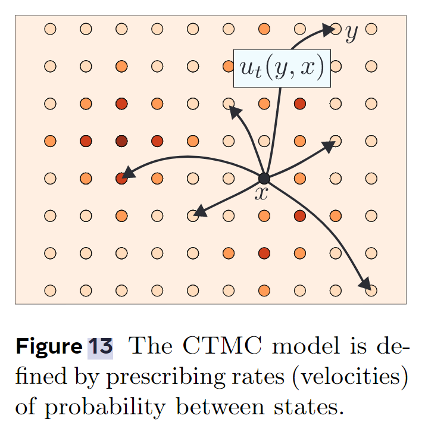

# 连续时间的马可夫链

本文基于Flow Matching Guide and Code[^1] ，主要是读这篇文章时候的笔记。

连续时间的马可夫链（Continuous Time Markov Chains，CTMC）是Flow的替代，也是一种生成式模型，用来生成离散的数据。它是离散型Flow Matching（Discrete Flow Matching， DFM）[^2]的基础。

## 离散状态空间和随机变量

这一节就是讲一些notations。

以类比的方法可以表示离散状态空间：

- 连续状态空间： $$\mathbb{R}^{d}$$，$$d$$是空间维度

- 离散状态空间：$$\mathcal{S} = \mathcal{T}^d$$，$$d$$是空间维度，其中$$\mathcal{T}=[K]=\{1,2,\cdots, K\}$$，$$\mathcal{T}$$也就是vocabulary。

从$$\mathcal{S}$$中采样的样本记为$$x = (x^1,x^2,\cdots,x^d)\in\mathcal{S}$$，其中$$x^i$$就是一个token。

用$$X$$表示状态空间$$\mathcal{S}$$中的随机变量，其pmf（probability mass function，概率质量函数，离散分布叫概率质量函数，连续分布叫概率密度函数）为$$p_X : \mathcal{S} \to \mathbb{R}_{\ge 0}$$，实际上pmf是一个从状态空间$$\mathcal{S}$$到正实数集的映射。pmf满足求和为1的约束条件：$$\sum_{x\in\mathcal{S}}p_X(x)=1$$。

对于事件$$A\in\mathcal{S}$$，其发生概率可以如下计算：
$$\mathbb{P}(X\in A)=\sum_{x\in A}p_X(x)\\$$
还需要一个delta分布（好像也叫Dirac分布）的pmf表示，如下：
$$$$
\delta(x,z)=\begin{cases}
 +\infty \quad x=z\\
 0\quad \text{else}.
\end{cases}
$$$$
这个分布表示只有$$x$$取特定值$$z$$的时候才有概率，没有概率取其他值。但是该分布的pmf在x的定义域积分也是1。

有时候也会在token层级上定义delta分布，例如$$\delta(x^i,y^i)\quad x^i,y^i \in \mathcal{T}$$。

关于Dirac分布的更多信息可以参考：https://spaces.ac.cn/archives/1870

## CTMC生成式模型

CTMC是连续时间的马可夫链，马可夫链是离散状态的马可夫过程。所以CTMC是连续时间离散状态的马可夫过程，可以表示为$$(X_t)_{0\le t\le 1}$$。因为CTMC是随机过程嘛，所以它是一族随机变量。它的马可夫假设可以表示为如下的形式：
$$\mathbb{P}(X_{t+s}=z\mid X_s =x,X_u=y,0\le u\le s)=\mathbb{P}(X_{t+s}=z\mid X_s = x)\\$$
类比离散时间的马可夫链，这个公式说的就是只要知道$$X_s$$的值后，在$$s$$时刻之前的值（例如式子中的$$X_u$$），对$$s$$时候之后的值没有影响（式中$$X_{t+s}$$）。即“遗忘过去”。关于CTMC更多的介绍可以参加：https://www.math.pku.edu.cn/teachers/lidf/course/stochproc/stochprocnotes/html/_book/markovc.html#markovc-ctime。

类比扩散模型和Flow Matching，也可以定义CTMC的转移核（probability transition kernel）为$$p_{t+h\mid t}$$，其形式如下：
$$p_{t+h\mid t}:= \mathbb{P}(X_{t+h}=y\mid X_t = x)=\delta(y,x)+hu_t(y,x)+o(h), \quad \mathbb{P}(X_0=x)=p(x)\\$$
$$p_{t+h\mid t}$$的图示如下：

CTMC模型的状态转移过程图示

公式6中，$$p$$表示随机过程$$(X_t)_{0\le t\le 1}$$在$$t=0$$时候的分布（取$$t=0$$随机过程退化成随机变量）。$$o(h)$$是高阶无穷小量
$$\lim_{h\to0} \cfrac{o(h)}{h} = 0\\$$
其中，$$u_t(y,x)$$叫做速率（rates或者velocities），它可以类比Flow Matching里面讲的向量场，在CTMC里面表示的是表示状态之间概率转换的速率，按我的理解，就是下面的这个形式：
$$$$
u_t(y,x) =\lim_{h\to 0}\cfrac{\mathbb{P}(X_{t+h}=y\mid X_t = x)}{h}

$$$$
它是时间$$t$$的函数。从公式8和公式6的角度理解，$$\delta(y,x)$$就是发生状态转移前（即$$t$$时刻）的初始状态。具体讲，由于我们以$$X_t=x$$为条件，所以初始状态就是确定的，用概率形式表示就是$$\delta(\cdot,x)$$，也就是说初始状态时（即$$t$$时刻），在$$x$$处有概率，而其他状态空间中的点概率都是0。

公式6中，$$u_t(y,x)$$需要满足一定的条件，称为速率条件（rate conditions）：
$$u_t(y,x)\ge 0 \text{ for all } y\neq x \text{, and }\sum_{y}u_t(y,x) =0 \\$$
这样就是说，$$u_t(x,x)< 0$$，且$$u_t(x,x)=-\sum_{y\neq x}u_t(y,x)$$。速度条件的存在是为了保证公式6算出的转移核$$p_{t+h\mid t}(\cdot\mid x)\ge0$$且$$\sum p_{t+h\mid t}(\cdot\mid x)=1$$。

类比Flow Matching，我们也可以说：**如果存在$$p_{t+h\mid t}$$满足公式6，$$p_{t+h\mid t}$$的边缘分布为$$p_t$$，则称$$u_t$$生成了$$p_t$$**。

用公式6，我们也可以用Euler法（类比扩散模型和Flow Matching里面ODE的解法）来采样，如下：
$$\mathbb{P}(X_{t+h}=y\mid X_t)=\delta(y,X_t)+hu_t(y,X_t)\\$$
但是该式引入了一个偏差，就是$$o(h)$$。因为这是一个高阶小量，所以只要$$h$$足够小，那么$$o(h)$$就会趋于0，这就是希望Euler法采样准确的条件，但是这样采样步骤就会很多。一种缓解这个问题的方法是用如下的Euler法：
$$$$
\mathbb{P}(X_{t+h}=y\mid X_t) =\begin{cases}
\exp \left[hu_t(X_t,X_t)\right] \qquad \qquad\qquad\qquad\qquad y=X_t \\
\cfrac{u_t(y,X_t)}{\left|u_t(X_t,X_t) \right|}\left(
	1 - \exp\left[hu_t(X_t,X_t)\right]
\right) \qquad y\neq X_t
\end{cases}
$$$$

## 概率路径和Kolmogorov方程

类比连续情况下的一致性方程（Continuity Equation），CTMC模型的边缘概率$$p_t$$满足Kolmogorov方程：
$$\cfrac{\mathrm{d}}{\mathrm{d}t}p_t(y)=\sum_x u_t(y,x)p_t(x) \\$$
下面这个定理描述了上式这种线性ODE系统唯一解的存在性：

**定理**（线性ODE的解的存在性和唯一性）：如果$$u_t(y,x)$$在$$C([0,1))$$中（即在时间$$t$$上连续），那么存在唯一的解$$p_t(x)$$满足Kolmogorov方程12，其中，$$t\in[0,1)$$，初始状态$$p_0(x) = p(x)$$。

对CTMC而言，在$$t\in[0,1)$$区间，不需要额外的条件，就能够确定解一定存在。关于该定理的更多详细信息可以参考Coddington et al. (1956)[^3]中的定理5.1和5.2。

方程12可以化为：
$$$$
\begin{equation}
\begin{aligned}
\sum_x u_t(y,x)p_t(x) &=\underbrace{\sum_{x\neq y} u_t(y,x)p_t(x)}_{输入通量}-\underbrace{\sum_{x\neq y}u_t(x,y)p_t(y)}_{输出通量} \\
&=-\sum_{x\neq y}\left[j_t(x,y)-j_t(y,x)\right] \\
\end{aligned}
\end{equation}
$$$$
其中，$$j_t(y,x):=u_t(y,x)p_t(x)$$，称为概率通量（probability flux）。上式很好理解，就是把从$$x$$输入到$$y$$的通量分成了从$$x$$输入到$$y$$的部分和从$$y$$输出到$$x$$的部分。

将输出通量超出来的部分定义为散度，即
$$\text{div}(u_t p_t)(y) =\sum_{x\neq y}\left[j_t(x,y)-j_t(y,x)\right]\\$$
那么Kolmogorov方程就可以表示为：
$$\dot p_t(y)+\text{div}(u_t p_t)(y)=0\\$$
这和连续型Flow Matching的一致性方程统一起来了。

以下还有一个结果，是在CTMC 框架中构建概率路径和速度的主要工具：

**定理** （离散质量守恒，Discrete Mass Conservation）：$$u_t(y,x)$$在$$C([0,1))$$中，$$p_t(x)$$在$$C^1([0,1))$$中（我的理解是一阶导数在时间$$t$$上连续），则如下两个结论是等价的：

- 在$$t\in[0,1)$$时， $$p_t,u_t$$满足Kolmogorov方程12，$$u_t$$满足速率条件9。
- 在$$t\in[0,1)$$时，$$u_t$$生成（用前文的术语）了$$p_t$$。

该定理的证明在[^1]的appendix A.1.。

### 保概率速率（Probability preserving velocities）

如果$$u_t(y,x)$$生成了概率路径$$p_t(x)$$，我们构造一个新的速率：
$$\tilde u_t(y,x) = u_t(y,x) + v_t(y,x)\\$$
只要$$v_t(y,x)$$满足速率条件且
$$\sum_x v_t(y,x)p_t(x) = 0\\$$
那么$$\tilde u_t(y,x)$$还能Kolmogorov方程：
$$\sum_x \tilde u_t(y,x)p_t(x) = \sum_x  u_t(y,x)p_t(x) = \dot p_t(y)\\$$
那么$$\tilde u_t(y,x)$$还能生成$$p_t(x)$$。这个结论在离散型Flow Matching里面非常重要。

---

[^1]: Lipman Y, Havasi M, Holderrieth P, et al. Flow Matching Guide and Code[J]. arXiv preprint arXiv:2412.06264, 2024.
[^2]: Gat I, Remez T, Shaul N, et al. Discrete flow matching[J]. arXiv preprint arXiv:2407.15595, 2024.
[^3]: Coddington E A, Levinson N, Teichmann T. Theory of ordinary differential equations[J]. 1956.